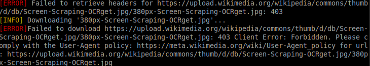

# Arachnida
A suite of web scrapers and metadata editors designed for efficient web and image data processing:

- **`Harvestmen`**: A tool for searching and extracting strings from web pages.
- **`Spider`**: A scraper for finding images or specific strings within HTML image tags.
- **`Scorpion`**: A utility for viewing metadata from image files and searching strings in them.
- **`Scorpion Viewer`**: A more advanced tool for displaying, deleting, and modifying metadata in image files.

## Testing

You can run basic tests with:
```sh
# Harvestmen (find a string on a webpage)
./tests.sh -h

# Spider & Scorpion (find images on a webpage and open the image folder and the metadata editor once done)
./tests.sh -s
```

---
## Harvestmen (strings)

This module implements a web scraper that recursively searches for a specified string within the content of a given base URL and all reachable links from that URL. The script utilizes the `requests` library to fetch web pages and `BeautifulSoup` from the `bs4` library to parse HTML content. 

---
### Key Features:
- **Recursive Scraping**: The scraper navigates through all links found on the base URL and continues to scrape linked pages unless restricted by the user.
- **Search Functionality**: It checks for the presence of a user-defined search string in the text of each page, with an option for case-insensitive searching.
- **Visited URL Tracking**: The script maintains a list of visited URLs to avoid processing the same page multiple times.
- **Skip Limit**: Users can set a limit on the number of skipped links (either due to already visited pages or bad links) before the scraper terminates.
- **Command-Line Interface**: The script accepts command-line arguments for the base URL, search string, case sensitivity, single-page mode, and skip limit.
---
### Usage:
```
usage: harvestmen.py [-h] -s SEARCH_STRING [-i] [-r] [-l RECURSE_DEPTH] [-k KO_LIMIT] link

This program will search the given string on the provided link and on every link that can be reached from that link, recursively.

positional arguments:
  link                  the name of the base URL to access

options:
  -h, --help            show this help message and exit
  -s SEARCH_STRING, --search-string SEARCH_STRING
                        the string to search
  -i, --case-insensitive
                        Enable case-insensitive mode
  -r, --recursive       Enable recursive search mode
  -l RECURSE_DEPTH, --recurse-depth RECURSE_DEPTH
                        indicates the maximum depth level of the recursive download. If not indicated, it will be 5. (-r/--recursive has to be activated).
  -k KO_LIMIT, --ko-limit KO_LIMIT
                        Number of already visited/bad links that are allowed before we terminate the search. This is to ensure that we don't get stuck into a
                        loop.
  -v, --verbose         Enable verbose mode.
  -S, --sleep           Enable sleep between HTTP requests to mimic a human-like behavior
  -t MAX_SLEEP, --max-sleep MAX_SLEEP
                        Maximum duration of the random sleeps between HTTP requests. If not indicated, it will be 3. (-s/--search-string has to be activated).
```
---
## Spider (images, strings in image tags and filenames)

This module implements a web image scraper that recursively searches for images on a specified base URL and downloads them to a designated folder. 

---
### Key Features:

- **Image downloading**: The scraper identifies and downloads images from the base URL and any linked pages, saving them to a specified local directory. If no directory is specified, it defaults to `./data/`.
- **Search functionality**: Users can specify a search string to filter images based on their alt text/filename. The scraper supports both case-sensitive and case-insensitive modes.
- **Recursive scraping**: The script can perform recursive scraping through all links found on the base URL, with an option to set a maximum depth level for the recursion (default is 5).
- **Visited URL tracking**: It maintains a list of visited URLs to avoid processing the same page multiple times, with a configurable limit on the number of already visited or bad links allowed before termination (KO limit).
- **Open image folder option**: Users have the option to automatically open the image folder at the end of the program for easy access to downloaded images.
- **Memory limit**: Set a memory limit for downloaded images to a specified value in MB, with a default of 1000MB.
---
### Usage:
```
// Display help
python spider.py -h

usage: spider.py [-h] [-s SEARCH_STRING] [-p IMAGE_PATH] [-i] [-r]
                 [-l RECURSE_DEPTH] [-k KO_LIMIT] [-o]
                 link

This program will search the given string on the provided link and on every link
that can be reached from that link, recursively.

positional arguments:
  link                  the name of the base URL to access

options:
  -h, --help            show this help message and exit
  -s SEARCH_STRING, --search-string SEARCH_STRING
                        If not empty enables the string search mode: only images which 'alt' attribute contains the search string are saved
  -p IMAGE_PATH, --image-path IMAGE_PATH
                        indicates the path where the downloaded files will be saved. If not specified, ./data/ will be used.
  -i, --case-insensitive
                        Enable case-insensitive mode
  -r, --recursive       Enable recursive search mode
  -l RECURSE_DEPTH, --recurse-depth RECURSE_DEPTH
                        indicates the maximum depth level of the recursive download. If not indicated, it will be 5.
  -k KO_LIMIT, --ko-limit KO_LIMIT
                        Number of already visited/bad links that are allowed before we terminate the search. This is to ensure that we don't get stuck into a
                        loop.
  -o, --open            Open the image folder at the end of the program.
  -m MEMORY, --memory MEMORY
                        Set a limit to the memory occupied by the dowloaded images (in MB). Default is set to 1000MB.
  -v, --verbose         Enable verbose mode.
  -S, --sleep           Enable sleep between HTTP requests to mimic a human-like behavior
  -t MAX_SLEEP, --max-sleep MAX_SLEEP
                        Maximum duration of the random sleeps between HTTP requests. If not indicated, it will be 3. (-s/--search-string has to be activated).

// Ex. to scrap with a depth of 1 with a search string "42" with the open folder option on :
python3 spider.py "https://42.fr/le-campus-de-paris/diplome-informatique/expert-en-architecture-informatique" -r -l 1 -s "42" -o
```
---

## Scorpion (image file metadata)

### Description
This is the CLI for Scorpion. This program receives image files as parameters and parses them for EXIF and other metadata, displaying the information on the terminal.<br />
It displays basic attributes such as the creation date, as well as EXIF, or PNG data.

---
### Usage

```
usage: scorpion.py [-h] [-f [FILE ...]] [-d [DIR ...]] [-v] [-s SEARCH_STRING] [-i]

Extract EXIF data and other data from image files.

options:
  -h, --help            show this help message and exit
  -f [FILE ...], --files [FILE ...]
                        one or more image files to process
  -d [DIR ...], --directory [DIR ...]
                        one or more folders containing image files to process
  -v, --verbose         Enable verbose mode.
  -s SEARCH_STRING, --search-string SEARCH_STRING
                        the string to search
  -i, --case-insensitive
                        Enable case-insensitive mode
```
---

## Scorpion Viewer

### Description
* This is the GUI for Scorpion. This program let us delete and modify some of the metadata from the image files.<br />
* It can also search a specific string the the metadata.
* It uses `Tkinter` for the GUI and `Treeview` widget to present metadata in a structured, tabular format.

---
## Notes

### Mimicking human-like behavior
#### 1. **With User-Agent**
While attempting to download an image from Wikipedia, we encountered a failure due to the default User-Agent used by the `requests` library. The error message received was as follows:



To investigate further, we checked the default headers used by the `requests` library in Python:

```python
requests.utils.default_headers()
```

The output was:

```json
{
    'User-Agent': 'python-requests/2.31.0',
    'Accept-Encoding': 'gzip, deflate',
    'Accept': '*/*',
    'Connection': 'keep-alive'
}
```

As we can see, the default User-Agent was not compliant with Wikipedia's User-Agent policy. To resolve this issue, we added a custom User-Agent header to our requests:

```python
HEADER = {
    'User-Agent': 'Mozilla/5.0 (Windows NT 10.0; Win64; x64) AppleWebKit/537.36 (KHTML, like Gecko) Chrome/91.0.4472.124 Safari/537.36'
}
```

By using this custom User-Agent, we can successfully download images from Wikipedia without encountering the 403 Forbidden error:


#### 2. **With delay**
When building a web scraper, it's important to consider how our requests may be perceived by the target website. Rapid, consecutive requests can trigger anti-bot measures and may lead to your IP being blocked. To mitigate this risk and make our scraper behave more like a human user, we can implement delays between our HTTP requests.

#### **Why use delays?**
- Mimics human behavior: humans do not browse the web at lightning speed. By introducing random delays, our scraper can simulate more natural browsing patterns.
- Reduces server load: spacing out requests helps to reduce the load on the target server, which is considerate and can prevent our scraper from being flagged as abusive.
- Avoids rate limiting: many websites have rate limits in place. By pacing our requests, we can stay within these limits and avoid being temporarily or permanently banned.
---
#### **Implementation**
To further mimic human behavior, we used a randomized delay. This can be done using the `random` module, which can be utilized in conjunction with the `sleep` function:

```py
from time import sleep
from random import randint

def sleep_for_random_secs(min_sec: int = 1, max_sec: int = 3) -> None:
	"""
	Sleep for a random duration to mimic a human visiting a webpage.
	"""
	
	# Generate a random sleeping duration in seconds,
	# from a range = [min, max]
	sleeping_secs = randint(min_sec, max_sec)
	sleep(sleeping_secs)
```
---
### Understanding `robots.txt`

The `robots.txt` file is a standard used by websites to communicate with web crawlers and bots about which parts of the site should not be accessed or indexed.<br />
According to the [official website](http://www.robotstxt.org/faq/legal.html) of the `robots.txt` standard, "There is no law stating that /robots.txt must be obeyed, nor does it constitute a binding contract between site owner and user." This means that while it is a widely accepted practice to respect the directives in a `robots.txt` file, there are no legal repercussions for ignoring it.

--- 

### Modifying extensions
* Sometimes, certain websites do not recognize your ID photo image file because they expect a 'PNG' extension instead of 'JPEG'. Simply changing the file extension manually may not be sufficient.

* We discovered that modifying the `Image.format` attribute using the `Pillow library (PIL)` effectively allows the file to be recognized with the desired extension and successfully passes the checks.

### Exif labels
* EXIF metadata uses numerical identifiers (integers) to represent specific tags, but these integers are not human-readable. To work effectively with EXIF data, you need a way to map these numerical codes to their corresponding tag names and descriptions. 

* We got the Exif Tags from: <a href="https://exiv2.org/tags.html">exiv2.org</a>.
The original tags are in `standard_exif_tags.txt`.
Only the needed columns are stored in `exif_labels.py`.

```sh
# Make a dictionary from the data on the website in `exif_labels.py`
./generate_exif_labels_dict.sh
```

### Time related metadata
#### Creation Time 
Here’s a refined version of the README section for clarity and readability:

---

### Challenges Faced

1. **Linux Limitation on `Creation Time`**:
   - Linux does not natively support or store a `Creation Time` attribute in the same way as Windows. This limitation prevents direct modification of the `Creation Time` metadata on Linux systems.

2. **Behavior of `Image.save()` Method**:
   - The `Image.save()` method in Python creates a new image file and deletes the original one during the save process. As a result, all time-related metadata (`Creation Time`, `Access Time`, and `Modification Time`) are updated to reflect the time of the save operation, unintentionally overwriting the original timestamps.

3. **Attempted Workaround**:
   - To address the issue, we attempted a workaround where the `Image.save()` operation was performed on a temporary file. The temporary file was then copied to the destination path. However, even with this approach, the destination file's `Access Time` and `Modification Time` were updated because the file system treats the copy operation as an access and modification event.

```python
def save_image_without_time_update(img, file_path, info):
    with NamedTemporaryFile(delete=False) as temp_file:
        temp_path = temp_file.name + ".png"
        img.save(temp_path, exif=info)

    # Copy the temporary file to the original path
    shutil.copyfile(temp_path, file_path)

    # Remove the temporary file
    os.remove(temp_path)

save_image_without_time_update(img, file_path, exif_data)  
```
4. **Successful Modification of `Modification Time`**:
   - The only case where the result reflected our intent was when modifying the `Modification Time`. After the file was created (and its `Modification Time` was unintentionally updated), we explicitly updated the `Modification Time` value, effectively erasing the unintentional update and applying the desired value.

---
### Common Image (PIL) Methods
```
    img.show():
        This method displays the image using the default image viewer on your system.

    img.save(fp, format=None, **params):
        This method saves the image to a file. You can specify the file path and format (if different from the original).

    img.resize(size):
        This method resizes the image to the specified size (a tuple of width and height) and returns a new image object.

    img.convert(mode):
        This method converts the image to a different color mode (e.g., from 'RGB' to 'L' for grayscale) and returns a new image object.

    img.thumbnail(size: tuple[float, float]):
        This method modifies the image to contain a thumbnail version of itself, no larger than the given size. This method calculates an appropriate thumbnail size to preserve the aspect of the image, calls the draft() method to configure the file reader (where applicable), and finally resizes the image.
```
More [here](https://pillow.readthedocs.io/en/stable/reference/Image.html).

---

### Documentation
* [Pillow Doc on handled Image File Formats](https://pillow.readthedocs.io/en/stable/handbook/image-file-formats.html)
* [Examples of JPG files with EXIF data](https://github.com/ianare/exif-samples)
